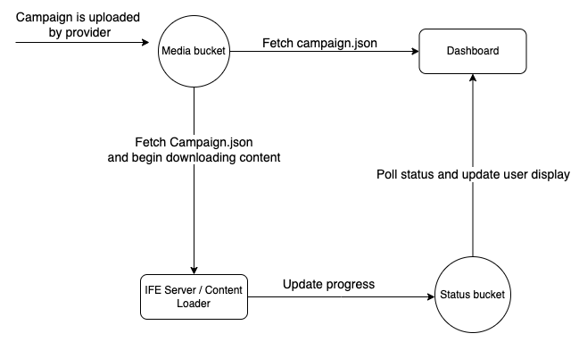

<pre><code>Date: Sep 25, 2024
 by IdeaNova Technologies, Inc.
</code></pre>

# Content Download and Dashboard Implementation

This is an overview of how the content loader is being used in a wider system alongside the dashboard. The system consists of three components, the __Staging__ bucket, the __Status__ bucket, and the __Dashboard__.

## Overview
1. Content Loader
   * Downloads content from the Staging bucket to the aircraft's IFE server.
   * Throughout the download, updates the Status bucket with progress and errors occured.
2. Dashboard
   * Polls the Status bucket for download progress updates
   * Displays the progress of each aircraft and its respective campaign contents to the user.

  
  #
  

## S3 Buckets

### Media
* An S3 bucket where content to be downloaded is held
* Metadata will be stored at `<airline>/<campaign-name>/campaign.json` 
* Content will be stored at `<airline>/<campaign-name>/<content-name>.tgz`
* `campaign.json` will contain a list of content items that content loader will refer to and download the corresponding `.tgz` files

### Status
* An S3 bucket where download progress will be updated
* Upon the start of a campaign, the `<airline>/<tail-id>/<campaign-name>` prefix will be added to the status bucket
* Each content item will have a corresponding progress file
  * `<airline>/<tail-id>/<campaign-name>/<content>.tgz.progress`
  * The progress file will simply store the number of bytes downloaded, e.g. "4194304"
* Each content item will have a corresponding error file
  * `<airline>/<tail-id>/<campaign-name>/<content>.tgz.error`
  * The error file will only be created if an error occurs downloading that content item

## Dashboard
1. Detecting a new campaign
   * Backend will periodically poll the `status/<airline>/<tail-id>` buckets to detect a new `<campaign-name>`
2. Monitoring Progress
Once a new campaign is detected, the backend will start tracking the progress of each content item.

   * __Progress File Monitoring__:
      - The dashboard will poll the campaign prefix for new `.progress` files and start to periodically check that file.
      - On each change in progress, the frontend will receive the new progress and update the table.

   * __Error Monitoring__:
      - The dashboard will also monitor the `<campaign-name>` prefix for all mid-download content items for the `.error` file.
      - If one is detected, the backend will grab the error message from the file, and display it on the frontend.
  
   * __Display__:
      - Airline View: displays a progress bar alongisde the metadata for each tail in the airline. If an error has occured, it should be visible.
      - Aircraft (Tail) View: Shows which content items are currently downloading, along with the message if applicable.

3. Understanding progress
  The content loader will only provide the current bytes downloaded in the `.progress` files. So the backend is responsible for fetching additional information from the `campaign.json`. The backend will get the total size of each file from the metadata, and use this to track the percentage of completion at both a campaign level, and a specific content item level.
